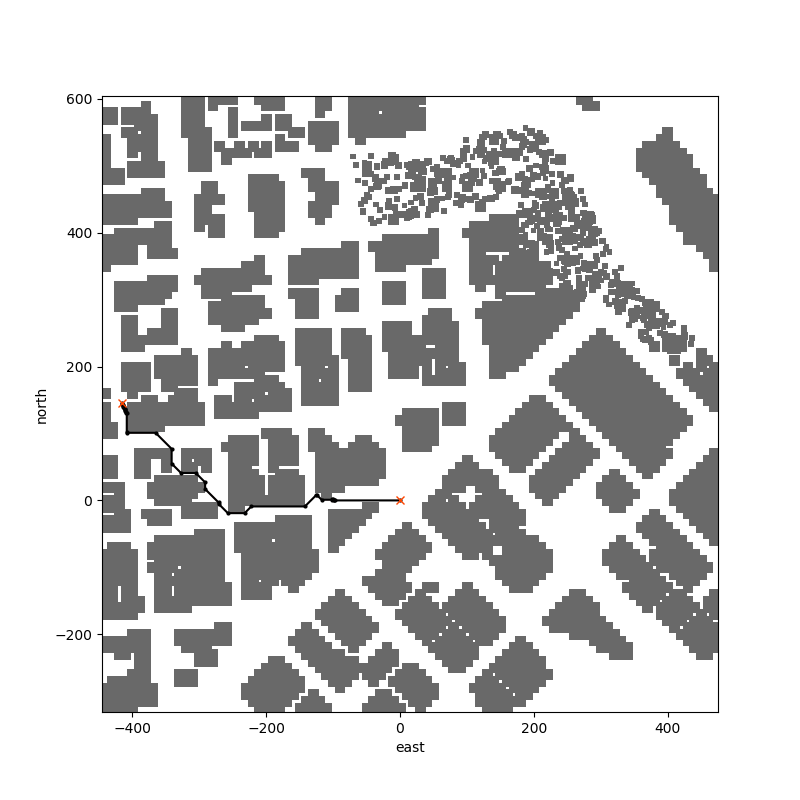

## Project: 3D Motion Planning Writeup

The following is a writeup/summary of the Flying Cars NanoDegree Motion-Planning project.   

Source files referenced in this project include:

- motion_planning.py
- planning_utils.py
- graph_planning_utils.py
- plot_utils.py

The project implements both grid and graph based planning strategies.  In addition, includes some additional extensions of colinearity-based waypoint consolidation.

## [Rubric](https://review.udacity.com/#!/rubrics/1534/view) Points

### Explain the Starter Code

#### 1. Explain the functionality of what's provided in `motion_planning.py` and `planning_utils.py`

The starter code consists primarily of motion_planning.py and planning_utils.py.   In the state machine for the drone, and additional "planning" state is introduced between "arming" and "takeoff".   The planning state is handled by the plan_path() method.   Within the plan_path() method, a 2.5D obstacle file is read and interpreted for the given flight altitude via invoking create_grid() (located in the planning_utils module).   In addition, within the planning_utils module, an implementation of the a_star algorithm is used to plan the path between the grid starting and goal positions, to generate waypoints.

The code runs as-is, effectively establishing a plan that moves the drone 10m north, and 10m east of its starting location.  


### Implementing Your Path Planning Algorithm

#### 1. Set your global home position

The global home position is obtained from the obstacles first two lines of the obstacles file (in motion_planning.py:150) and used to set the global home location:

```python
# TODO: read lat0, lon0 from colliders into floating point values
lat0, lon0 = home_latlon('colliders.csv')

# TODO: set home position to (lon0, lat0, 0)
self.set_home_position(lon0, lat0, 0)
```

where home_latlon() extracts the longitude and latitude from the first line of the collders.csv file.

#### 2. Set your current local position

The local position is initialized via the global_to_local helper function in the udacidrone package (in motion_planning.py:162)

```python
local_north, local_east, _ = global_to_local(self.global_position, self.global_home:)
```

#### 3. Set grid start position from local position
The grid starting position is determined by adjusting the local position by the north and east offsets.  The offsets come from the fact that the colliders file defines obstacles by their center position.  (motion_planning.py:175)

```python
local_start = self.local_position[:]
grid_start = coord_to_grid(local_start, north_offset, east_offset)
```

where coord_to_grid() is defined in planning_utils.py as:

```python
def coord_to_grid(coord, north_offset, east_offset):
    return (int(round(coord[0] - north_offset)), int(round(coord[1] - east_offset)))
```

#### 4. Set grid goal position from geodetic coords
This step is to add flexibility to the desired goal location. Should be able to choose any (lat, lon) within the map and have it rendered to a goal location on the grid.

The global goal position is passed into the program via additional program arguments:

```
% python motion_planning.py --goal_lon -122.396685 --goal_lat 37.797194 --alt 5
```

and are loaded into the global_goal attribute.   The grid_goal is then initialized via the global_to_local helper function in the udacidrone package, along with offset adjustment from the obstacle data.  (motion_planning.py:184)

```
global_goal = (self.global_goal[0], self.global_goal[1], self.global_goal[2]) 
local_goal = global_to_local(global_goal, self.global_home)
grid_goal = coord_to_grid(local_goal, north_offset, east_offset)
```

#### 5. Modify A* to include diagonal motion (or replace A* altogether)

The project includes both grid and graph-based A* algorithms.   The planner type is selected on the command line via the '--planner_type' argument:
```
% python motion_planning.py --goal_lon -122.396685 --goal_lat 37.797194 --alt 5 --planner_type grid
```
Options are "grid" or "graph" (default "grid").

##### 5a.  Grid-Based A*

The grid-based A* algorithm is in the planner_utils module and is extended to support diagonal movements (and associated costs).

Waypoint generation via the grid-based algorithm tended to be relatively slow (as compared to graph-based), as well as generated significantly more waypoints.  The paths generated were always weighted to the obstacles closest to the goal (due to the influence of the heuristic).   

##### 5b.  Graph-Based A*

The graph-based A* algorithm is in the graph_planning_utils module.  The implementation uses the scikit-learn Voronoi module, the Bressenham module as well as the NetworkX module.  Using these modules, and a modified version of the A* algorithm in the starter framework, a path is constructed from grid start to goal.

##### 5c.   Example Plans

 


#### 6. Cull Waypoints 

The project includes both three-point collinear waypoint pruning algorithm, as well as a 'normalized' algorithm (for lack of a more descriptive word).  The path-pruning algorithm is selected on the command line via the '--prunepath_type' argument:
```
% python motion_planning.py --goal_lon -122.396685 --goal_lat 37.797194 --alt 5 --planner_type grid --prunepath_type normalize
```
Options are "orig" or "normalize" (default "grid").

##### 6a.  Three-Point Collinearity

The standard three-point collinearity test uses the determinant (which represents the area of the triangle formed by the three points) compared to some residual value, to determine the degree of collinearity between the points. 

<p style="text-align:center">

</p>

Here, even though the horizontal deviation of p2 is the same, depending on an epsilon value (or residual value) used for thresholding the determinant, the bottom image might be misclassified as non-collinear even though the deviation of p2 from the line is the same.

##### 6b.  Normalized Collinearity Test

In order to get around the scale problem, came up with a heuristic that scales the determinant with the distance between the points.  In order to insure that real changes in direction are not missed (especially at longer cummulative distances), the heuristic test includes testing the last three points as well.   The value of epsilon is calibrated to the deviation distance, and then used in the two thresholding criterias.

<p style="text-align:center">

</p>

The first part involves calibrating an epsilon value to the max desired path offset:

```python

def calibrate_prunepath(path_offset):
    """
       epsilon = calibrate_prunepath(0.1*SAFETY_DISTANCE)
    """
    def point(p):
        return np.array([p[0], p[1], 1.]).reshape(1, -1)

    p1 = [0, 0]
    p2 = [20, path_offset]
    p3 = [40, 0]
    return abs(np.linalg.det(np.concatenate((point(p1), point(p2), point(p3)), 0))/np.linalg.norm(np.array(p1) - np.array(p3)))
```

The epsilon, or collinearity threshold is then used for the two threshold tests.   The first test (dist1) tests the normalized value of the full range.   The second test (dist2) tests to insure that larger incremental changes are bit missed when the overall starts becoming large and potentially dropping waypoints pre-maturely.

```python
def prunepath_normalized(path, epsilon):
    def point(p):
        return np.array([p[0], p[1], 1.]).reshape(1, -1)

    # use calibrated criteria, max length between waypoints.
    def collinearity_scaled(p1, p2, p3, trailing):
        dist = np.linalg.norm(np.array(p1) - np.array(p3))
        delta = abs(np.linalg.det(np.concatenate((p1, p2, p3), 0))/dist)
        if delta < epsilon:
            if trailing != None:
                # check for criteria on leading three points (for upcoming turns)
                return abs(np.linalg.det(np.concatenate((point(trailing), p2, p3), 0))/np.linalg.norm(np.array(point(trailing)) - np.array(p3))) < epsilon 
            else:
                return True 

        return False

    pruned_path = [p for p in path]
    i = 0
    trailing = None
    while i < len(pruned_path) - 2:
        collinear = collinearity_scaled(point(pruned_path[i]), point(pruned_path[i + 1]), point(pruned_path[i + 2]), trailing)
        if collinear:
            trailing = pruned_path[i + 1]
            pruned_path.remove(pruned_path[i + 1])
        else:
            trailing = None
            i += 1
    return pruned_path

```

##### 6c.  Analysis.

The heuristic seemed to do a pretty good job, especially on grid-based paths in which there were diagonal segments.  In the images below, the original method reduced the waypoints form 467 to 63 (figure on the left), but the normalized heuristic did significantly better reducing the waypoints from 467 to 15.   

 


Further testing required, but illustrates the need for optimizing the waypoint culling to the specific path generation algorithm.

#### 7.  Dynamic Deadbands

To minimize unnecessary attitude changes, the waypoint transition tolerances were adjusted when the heading to the next waypoint was approximately the same as the current heading.   The default deadband is 1m.   if the current and next heading differ by less than 15 degrees, the deadband is increased to 5m.   If the current and the next heading is between approximately 15 and 25 degrees, the deadband is increased to only 2.5m.

```python
            waypoint_thresh = 1.0
            if len(self.waypoints) > 1:
                # calculate waypoint threshold based on next heading update
                next_heading = np.arctan2((self.waypoints[0][1] - self.target_position[1]), (self.waypoints[0][0] -  self.target_position[0]))
                if abs(self.heading - next_heading) < 0.25:
                    waypoint_thresh = 5.0
                elif abs(self.heading - next_heading) < 0.40:
                    waypoint_thresh = 2.5

            if np.linalg.norm(self.target_position[0:2] - self.local_position[0:2]) < waypoint_thresh:
                if len(self.waypoints) > 0:
                    self.waypoint_transition()
                else:
                    if np.linalg.norm(self.local_velocity[0:2]) < 1.0:
                        self.landing_transition()
```


### Execute the flight

#### Notes

-- Simulator seemed to have issues wrt obstacles and would start the drone off within a building.  Both the following movie files illustrate this, as the ddrone would 'pop up' breaking thru the roof and then settle to specific altitude.

-- The Mavlink connection would allows a timeout argument, but it is ignored (hard-coded to 1 minute within the udacidrone module).   To get around paths (particularily grid-based) that would take longer than one minute, added arguments to dump/load (pickle) a generated path.

#### Courtyard via Graph-Based A-star

[Courtyard - MP4](recordings/courtyard-graph.MP4)

#### Mission & Stewart via Grid-Based A-star

[Mission & Stewart - MP4](recordings/missionstewart-grid.mp4)

### Double check that you've met specifications for each of the [rubric](https://review.udacity.com/#!/rubrics/1534/view) points.
  


